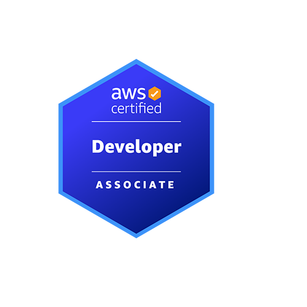
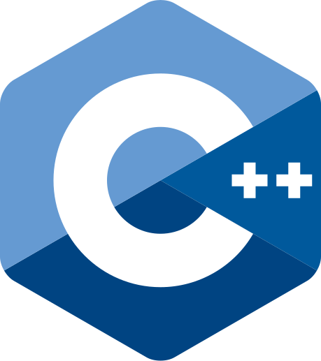

<!--
**Banudeep/Banudeep** is a ✨ _special_ ✨ repository because its `README.md` (this file) appears on your GitHub profile.

Here are some ideas to get you started:

- 🔭 I’m currently working on ...
- 🌱 I’m currently learning ...
- 👯 I’m looking to collaborate on ...
- 🤔 I’m looking for help with ...
- 💬 Ask me about ...
- 📫 How to reach me: ...
- 😄 Pronouns: ...
- ⚡ Fun fact: ...
-->

<h1 align="center">Hi 👋, I'm Keerthana Reddy Singireddy</h1>
<h3 align="center">Software Engineer | Full Stack Developer</h3>

  Passionate about building scalable, secure applications using cloud-native tools.
    
  <a href="https://www.linkedin.com/in/keerthana-reddy-singireddy-337157215/">💼 LinkedIn</a>

---

## 🏆 Certifications

  
  

---

## 🛠️ Tech Stack

#### 🖥️ Programming Languages

  
  
  
  
  
  
  
  
  

#### 🧩 Frontend Frameworks

  
  
  
  

#### ⚙️ Backend & APIs

  
  
  
  

#### 🛢️ Databases

  
  

#### ☁️ Cloud & DevOps

  
  
  
  

---

## 💼 Work Experience

- **Exploration Support Staff** @ George Mason University _(Present)_
  - Specialized in tutoring and mentoring students with disabilities in core programming and database courses,
    including Python, Java, and SQL.
  - Designed and adapted course curricula to enhance accessibility and comprehension for diverse learning needs.
  - Delivered individualized support for coding assignments, reinforcing key programming concepts and best practices.

- **Software Engineer** @ Diligent Global _(May 2023 – Jul 2023)_
  -  Engineered and deployed high-performance server-side applications using Next.js achieving a 40% reduction in server response time
  -   Implemented sequential chatbots , optimizing user interaction flows and increasing customer engagement.
  -   Architected intuitive user interfaces and was part of web design that boosted user satisfaction.
  -   Optimized database management processes by integrating multiple databases into cohesive backend systems.
    
- **Associate Software Engineer** @ OpenText _(July 2021 – Jul 2022)_
  - Enhanced the Content Management System (XECM) for SAP SuccessFactors by designing and developing feature upgrades using Agile Methodologies.
  - Implemented containerized testing strategies with Docker and Kubernetes.
  -  Collaborated with cross-functional and global teams for feature upgrade demos and troubleshooting 

---
